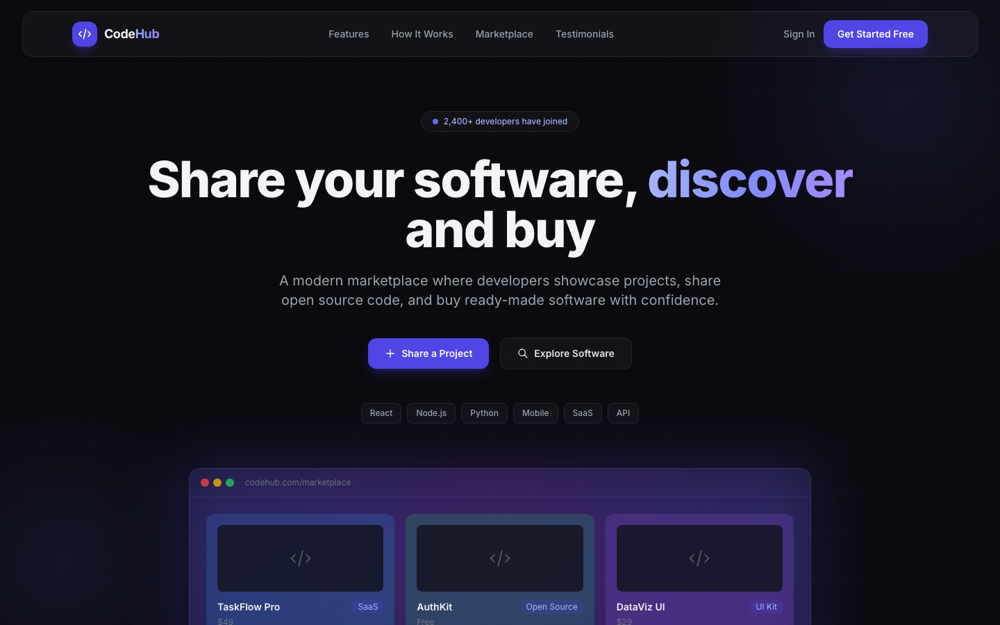
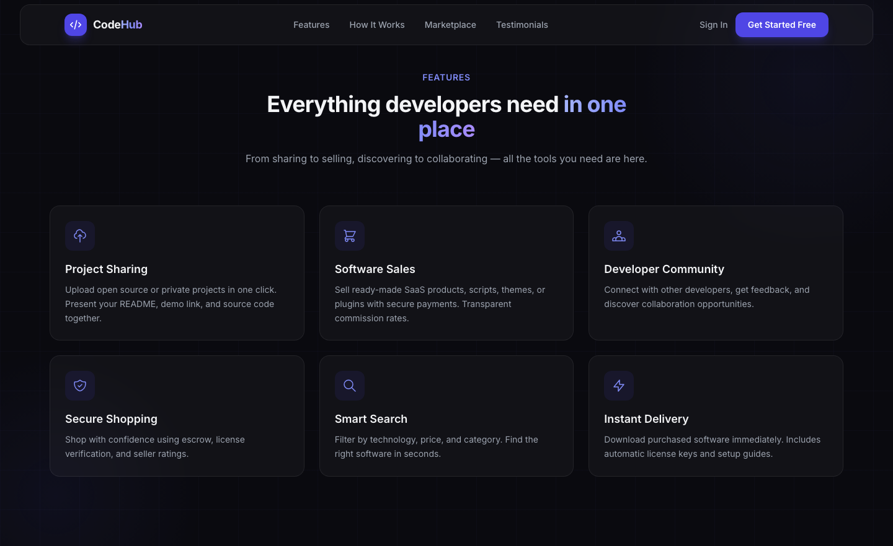
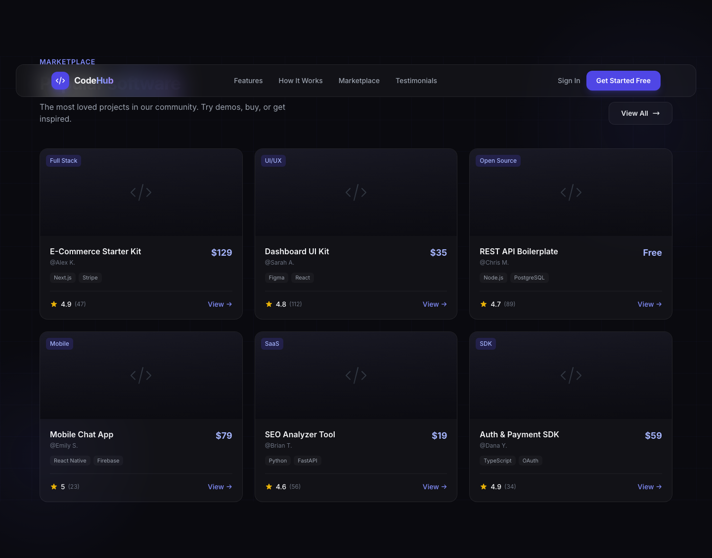
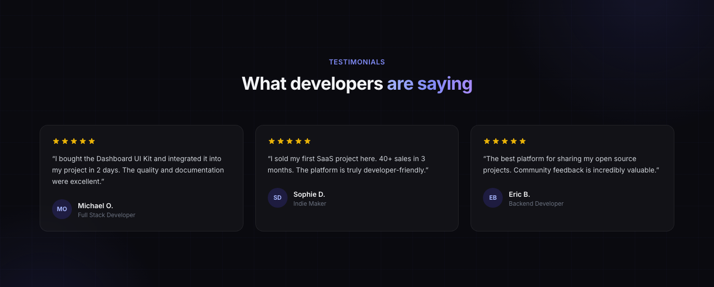

# CodeHub

A modern marketing website for a software marketplace platform. Developers can share projects, discover software, and buy ready-made solutions — all in one place.


## Preview

This is a **frontend-only** marketing landing page with no backend. All buttons and links are placeholders for demo purposes.

### Hero



### Features



### Marketplace



### Testimonials



### Sections

- **Hero** — Headline, CTAs, and browser preview mockup
- **Features** — Project sharing, software sales, community, secure shopping
- **How It Works** — 3-step onboarding flow
- **Marketplace** — Sample software product cards
- **Stats** — Social proof metrics
- **Testimonials** — Developer reviews
- **CTA & Footer** — Sign-up call-to-action and site links

## Tech Stack

- [React 19](https://react.dev/)
- [Vite 6](https://vitejs.dev/)
- [Tailwind CSS 3](https://tailwindcss.com/)

## Getting Started

### Prerequisites

- [Node.js](https://nodejs.org/) 18 or later
- npm

### Installation

```bash
git clone https://github.com/YOUR_USERNAME/codehub.git
cd codehub
npm install
```

### Development

```bash
npm run dev
```

Open [http://localhost:5173](http://localhost:5173) in your browser.

### Production Build

```bash
npm run build
npm run preview
```

The built files will be in the `dist/` folder, ready to deploy on Vercel, Netlify, GitHub Pages, or any static host.

## Project Structure

```
├── docs/
│   └── screenshots/       # README preview images
├── public/
│   └── favicon.svg
├── src/
│   ├── components/
│   │   ├── Navbar.jsx
│   │   ├── Hero.jsx
│   │   ├── Features.jsx
│   │   ├── HowItWorks.jsx
│   │   ├── Marketplace.jsx
│   │   ├── Stats.jsx
│   │   ├── Testimonials.jsx
│   │   ├── CTA.jsx
│   │   └── Footer.jsx
│   ├── App.jsx
│   ├── main.jsx
│   └── index.css
├── index.html
├── tailwind.config.js
├── vite.config.js
└── package.json
```

## Author

**Vural Demir — Wency**

## License

This project is open source and available under the [MIT License](LICENSE).
